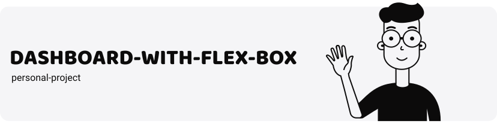
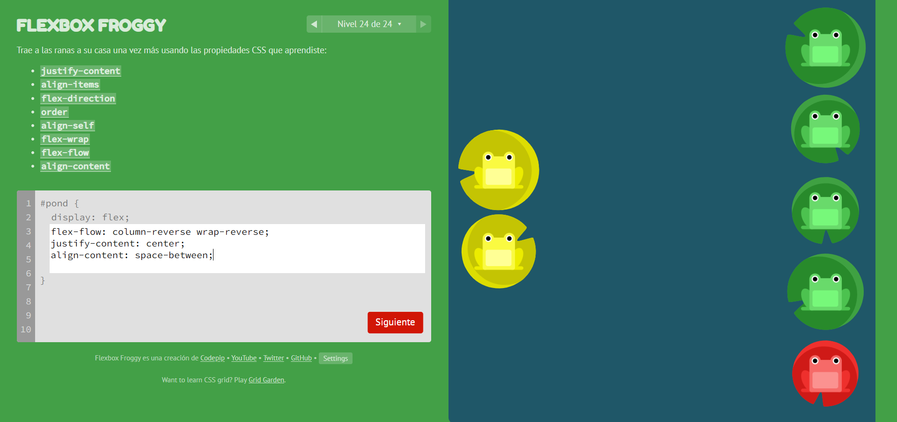
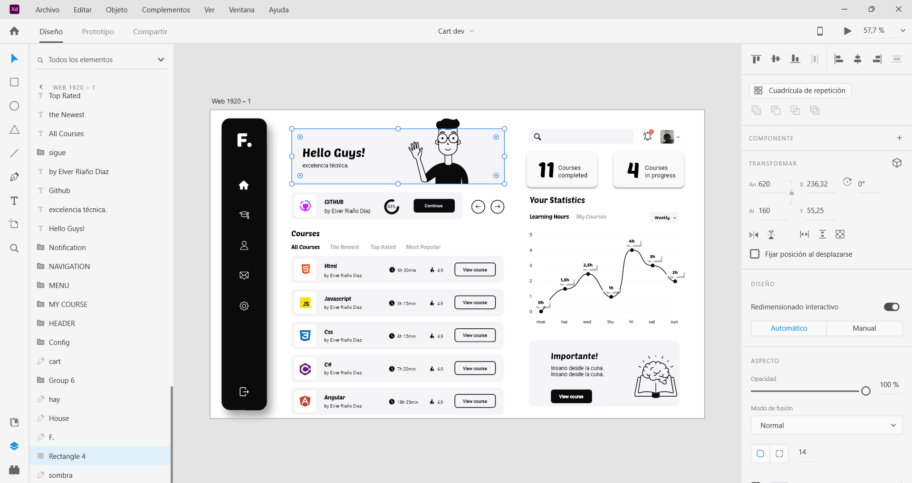

---

## Lo Aprendido

En el desarrollo de mi reciente proyecto, he profundizado considerablemente en diversas tecnologías y metodologías esenciales para la creación de aplicaciones web modernas. Utilizando **HTML**, **CSS** y **JavaScript**
<table>
<tr>
<td align="center"><a href="https://developer.mozilla.org/es/docs/Web/HTML"> HTML</a></td>
<td align="center"><a href="https://developer.mozilla.org/es/docs/Web/CSS"> CSS</a></td>
<td align="center"><a href="https://developer.mozilla.org/es/docs/Web/JavaScript"> JavaScript</a></td>
</tr>
</table>

## Convención BEM
he implementado la convención **BEM** (Block, Element, Modifier) para mantener un código CSS limpio y estructurado, lo que facilitó el mantenimiento y la escalabilidad del proyecto.

## Comandos con Git
Además, me familiaricé con varios comandos de **Git**, lo que me permitió gestionar el control de versiones de manera más eficiente, incluyendo el uso de convenciones para la creación de commits claros y descriptivos.

## Flex Box
La adaptabilidad del diseño también fue una prioridad, lograda a través de técnicas de **diseño responsivo** y la flexibilidad del **Flexbox**, garantizando que la interfaz se vea y funcione bien en una variedad de dispositivos.

### Course Flex Box

Asimismo, aprendí a clonar elementos con **JavaScript**, mejorando así la interactividad de la aplicación. 

## Adobe XD

También utilicé **Adobe XD** para diseñar y prototipar la interfaz de usuario de mi proyecto. Adobe XD me permitió crear un mockup, facilitando la visualización y planificación del diseño antes de su implementación.

##### Este proyecto no solo reforzó mis habilidades técnicas, sino que también mejoró mi capacidad para seguir mejores prácticas de desarrollo web y diseñar interfaces de usuario efectivas.

---

Para cualquier pregunta, contáctame por email: diazelver1016@gmail.com

